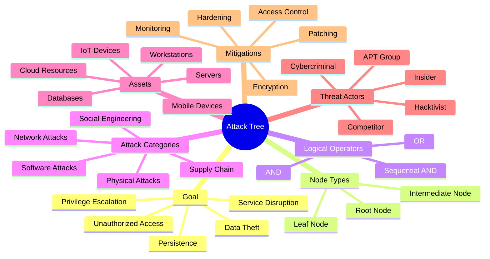

# **`Awesome`** [Attack](https://websites.fraunhofer.de/CIPedia/index.php/Attack_Tree) [Tree](https://wikipedia.org/wiki/Attack_tree) 

    
    &nbsp;
    
    &nbsp;
    
    

## 📖 Contents
- [My Other Awesome Lists](#my-other-awesome-lists)
- [Contributing](#contributing)
- [Contributors](#contributors)

##

### My Other Awesome Lists
You can access my other awesome lists [here](https://cyberthreatdefence.com/my_awesome_lists)

### Contributing
[Contributions of any kind welcome, just follow the guidelines](contributing.md)!

### Contributors
[Thanks goes to these contributors](https://github.com/cybersecurity-dev/awesome-attack-tree/graphs/contributors)!

[🔼 Back to top](#awesome-attack-tree-)
